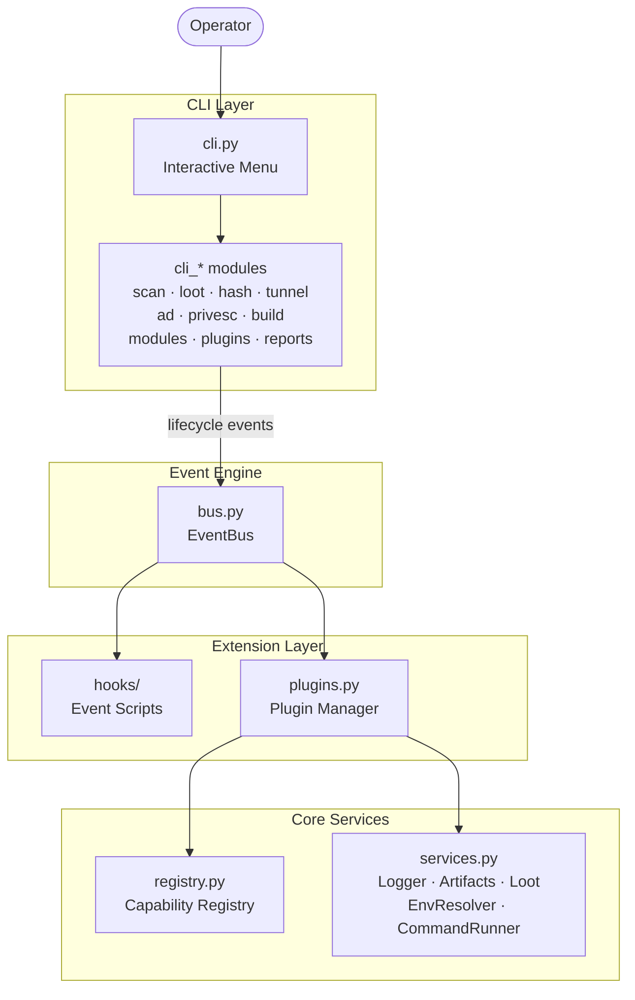

# Empusa

[](https://www.python.org/downloads/)
[](https://github.com/Icarus4122/empusa/actions/workflows/ci.yml)
[](https://codecov.io/gh/Icarus4122/empusa)
[](https://github.com/Icarus4122/empusa)
[](LICENSE)
[](#usage)
[](https://github.com/Textualize/rich)

**Shape-shifting recon, workflow orchestration, reporting, and extension management for terminal-first security operations.**

> *"She shifts form... beauty, beast, and death."*

Empusa is a Python-based console framework for organizing repeatable operator workflows around workspace management, environment setup, host scanning, loot tracking, exploit triage, report generation, module compilation, and event-driven extension points.

It is built around four core ideas:

- **Workspaces** for profile-aware engagement organization with template seeding and metadata tracking.
- **Structured environments** for keeping scan artifacts, credentials, and logs organized.
- **Lifecycle events** for automation without hard-wiring custom logic into the core CLI.
- **Extensibility** through both lightweight hooks and manifest-driven plugins.

---

## Quick Links

[](INSTALL.md)
[](CONTRIBUTING.md)
[](SECURITY.md)
[](CHANGELOG.md)
[](https://github.com/Icarus4122/empusa/issues)

---

## Table of Contents

- [Why Empusa](#why-empusa)
- [Feature Overview](#feature-overview)
- [Architecture](#architecture)
- [Installation](#installation)
- [Usage](#usage)
- [Workspaces](#workspaces)
- [Interactive Menu](#interactive-menu)
- [Non-Interactive Commands](#non-interactive-commands)
- [Environment Layout](#environment-layout)
- [Hooks](#hooks)
- [Plugins](#plugins)
- [Module Workshop](#module-workshop)
- [CLI Flags](#cli-flags)
- [Platform Notes](#platform-notes)
- [Development](#development)
- [Project Structure](#project-structure)
- [Roadmap Ideas](#roadmap-ideas)
- [Legal and Responsible Use](#legal-and-responsible-use)
- [License](#license)

---

## Why Empusa

Empusa is designed for users who want a single terminal workflow that can:

- create and maintain profile-aware engagement workspaces,
- centralize scan output and operator notes,
- track loot and credential material,
- generate reports from collected artifacts,
- extend behavior through event hooks and plugins, and
- manage small payload or helper modules from one interface.

The project is especially strong where **operator workflow consistency** matters more than one-off scripting.

---

## Feature Overview

### Workspace management

- Creates profile-aware workspaces with directory scaffolding and template seeding.
- Supports four workspace profiles: `htb`, `build`, `research`, `internal`.
- Tracks workspace metadata (profile, creation date, seeded templates).
- Lists, selects, and inspects workspaces non-interactively.
- Emits workspace lifecycle events for plugin integration.

### Environment and workflow management

- Builds named environments for one or more targets, standalone or inside a workspace.
- Tracks the active environment in-session.
- Detects previously created environments automatically.
- Summarizes discovered hosts when an environment is active.

### Scan-driven operations

- Runs host build workflows with configurable worker count.
- Stores scan output under host-specific folders.
- Places scan artifacts under the workspace `scans/` directory when a workspace is active, or in a flat layout when running standalone.
- Supports exploit-search workflows against saved `nmap` results.

### Loot and reporting

- Tracks loot entries in environment scope.
- Supports interactive and non-interactive loot operations.
- Builds Markdown reports from collected environment data.
- Emits reporting lifecycle events for extension points.

### Advisory utilities

- Reverse tunnel builder.
- Hash identification and crack-command helper.
- Hashcat rule generation.
- Privilege-escalation enumeration command generator.
- Active Directory enumeration playbook generator.

### Extensibility

- **Hooks** for simple `run(context)` Python scripts.
- **Plugins** for structured lifecycle integration with manifests, permissions, dependencies, and activation control.
- **Capability registry** for provider discovery and extension registration.

### Module Workshop

- Discovers module definitions from the bundled module directory.
- Detects available compilers on the local system.
- Supports multi-language module compilation workflows.
- Includes scaffolding for new module templates.

---

## Architecture

Empusa follows an event-driven console architecture with five distinct layers.



### Core layers

| Layer | Purpose |
| --- | --- |
| CLI | Interactive menu, workspace subcommands, and non-interactive subcommands |
| Workspace | Profile-aware directory scaffolding, template seeding, metadata tracking |
| Event bus | Dispatches lifecycle events to hooks and plugins |
| Hooks | Lightweight event handlers in Python |
| Plugins | Manifest-driven, permission-aware extension model |
| Services | Shared runtime primitives exposed to plugins |
| Registry | Capability registration and provider inventory |

### Service surface exposed to the framework

| Service | Purpose |
| --- | --- |
| `LoggerService` | Structured output and operator feedback |
| `ArtifactWriter` | Managed write operations for output artifacts |
| `LootAccessor` | Environment-scoped loot append/read support |
| `EnvResolver` | Active environment resolution and path handling |
| `CommandRunner` | Command execution with event emission hooks |

---

## Installation

### Requirements

| Dependency | Minimum | Notes |
| --- | --- | --- |
| Python | 3.9+ | Required |
| `rich` | installed automatically | CLI rendering |
| `nmap` | optional | Needed for scanning workflows |
| `searchsploit` | optional | Needed for exploit search workflows |

### Option 1: `pipx` recommended

```bash
pip install pipx
pipx ensurepath
pipx install git+https://github.com/Icarus4122/empusa.git
```

### Option 2: install from a local clone

```bash
git clone https://github.com/Icarus4122/empusa.git
cd empusa
pip install .
```

### Option 3: editable development install

```bash
git clone https://github.com/Icarus4122/empusa.git
cd empusa
pip install -e .
```

### Option 4: Docker

```bash
docker build -t empusa .
docker run -it --rm empusa
```

The included `Dockerfile` installs `nmap` and `exploitdb` inside the image.

### Verify the install

```bash
empusa --version
empusa --help
```

For platform-specific setup notes, see [INSTALL.md](INSTALL.md).

---

## Usage

### Launch interactive mode

```bash
empusa
```

### Run as a module

```bash
python -m empusa
```

### Global examples

```bash
empusa --verbose
empusa --dry-run
empusa --workers 16
empusa --no-color
```

---

## Workspaces

Workspaces are the primary organizational unit in Empusa.  A workspace is a profile-aware directory tree with metadata tracking, template seeding, and lifecycle events.

### Workspace lifecycle vs build lifecycle

Empusa separates two concerns:

| Concept | Scope | Commands |
| --- | --- | --- |
| **Workspace** | Engagement-level organization: directories, templates, metadata | `workspace init`, `workspace list`, `workspace select`, `workspace status` |
| **Build** | Target-level scanning: nmap, host enumeration, credential tracking | `build`, interactive menu option 1 |

A workspace can exist without any builds.  A build can run without a workspace (standalone flat layout).  When both are active, builds nest their artifacts inside the workspace's `scans/`, `creds/`, and `logs/` directories.

### Workspace profiles

| Profile | Directories | Templates |
| --- | --- | --- |
| `htb` | notes, scans, web, creds, loot, exploits, screenshots, reports, logs | engagement, target, recon, services, finding, privesc, web |
| `build` | src, out, notes, logs | *(none)* |
| `research` | notes, references, poc, logs | recon |
| `internal` | notes, scans, creds, loot, evidence, exploits, reports, logs | engagement, target, recon, services, finding, pivot, privesc, ad |

### Create a workspace

```bash
empusa workspace init --name resolute --profile htb
empusa workspace init --name resolute --profile htb --set-active
empusa workspace init --name resolute --profile htb \
    --root /opt/lab/workspaces \
    --templates-dir /path/to/templates \
    --set-active
```

### List workspaces

```bash
empusa workspace list
empusa workspace list --root /opt/lab/workspaces
```

### Select (activate) a workspace

```bash
empusa workspace select --name resolute
```

Selecting a workspace activates it for the current session.  Subsequent builds, scans, and reports operate against the workspace path.  The `session_env` key is also updated for backward compatibility with existing workflows.

### Inspect a workspace

```bash
empusa workspace status --name resolute
```

Shows profile, creation date, seeded templates, directory listing, and active indicator.

### Workspace events

| Event | When |
| --- | --- |
| `pre_workspace_init` | Before workspace directory tree is created |
| `post_workspace_init` | After workspace is fully scaffolded |
| `on_workspace_select` | When a workspace is activated |

Plugins can subscribe to these events to react to workspace changes - for example, initializing a git repo, copying extra templates, or registering the workspace with an external system.

### Session state

When a workspace is active, Empusa tracks four CONFIG keys:

| Key | Example |
| --- | --- |
| `workspace_name` | `resolute` |
| `workspace_root` | `/opt/lab/workspaces` |
| `workspace_path` | `/opt/lab/workspaces/resolute` |
| `workspace_profile` | `htb` |

The legacy `session_env` key is kept in sync with `workspace_name` so that existing build, scan, loot, and report flows continue to work without modification.

---

## Interactive Menu

The main interactive surface currently exposes these top-level actions:

| # | Action |
| --- | --- |
| `1` | Build New Environment |
| `2` | Build Reverse Tunnel |
| `3` | Generate Hashcat Rules |
| `4` | Search Exploits from Nmap Results |
| `5` | Loot Tracker |
| `6` | Report Builder |
| `7` | Select / Switch Environment |
| `8` | Manage Hooks / Plugins |
| `9` | Module Workshop |
| `10` | Privesc Enumeration Generator |
| `11` | Hash Identifier + Crack Builder |
| `12` | AD Enumeration Playbook |
| `0` | Exit |

When a workspace is active, option 1 (Build New Environment) passes the workspace path to the build flow.  Scan artifacts are placed under the workspace's `scans/` directory, credentials under `creds/`, and the command log under `logs/`.

### Plugin and Hook Manager

The manager surface includes:

| # | Action |
| --- | --- |
| `1` | View Hooks |
| `2` | Create Hook |
| `3` | Test Hook Event |
| `4` | Delete Hook |
| `5` | Open Hooks Folder |
| `6` | View Plugins |
| `7` | Create Plugin |
| `8` | Enable / Disable Plugin |
| `9` | Plugin Info & Config |
| `10` | Uninstall Plugin |
| `11` | Open Plugins Folder |
| `12` | View Capability Registry |
| `0` | Back to Main Menu |

---

## Non-Interactive Commands

Empusa supports scripted execution through subcommands.

### Build an environment

```bash
empusa build --env acme --ips 10.10.10.10,10.10.10.20
```

| Argument | Type | Required | Description |
| --- | --- | --- | --- |
| `--env NAME` | string | yes | Environment name |
| `--ips IP,IP,...` | comma-separated | yes | Target IP addresses |

When a workspace is active (via `workspace select`), build artifacts are placed inside the workspace layout.  Otherwise a flat directory is created at `<env-name>/` relative to CWD.

### Search exploits from a saved host folder

```bash
empusa exploit-search --env acme --host 10.10.10.10-Linux
```

| Argument | Type | Required | Description |
| --- | --- | --- | --- |
| `--env NAME` | string | yes | Environment name |
| `--host FOLDER` | string | yes | Host folder name (from build output) |

### List loot

```bash
empusa loot --env acme list
```

### Add loot

```bash
empusa loot --env acme add \
  --host 10.10.10.10 \
  --cred-type password \
  --username admin \
  --secret 'SuperSecret!' \
  --source smb
```

| Argument | Type | Required | Description |
| --- | --- | --- | --- |
| `--env NAME` | string | yes | Environment name |
| `loot_action` | `list` \| `add` | yes | Loot operation |
| `--host` | string | for `add` | Target host |
| `--cred-type` | string | for `add` | Credential type |
| `--username` | string | for `add` | Username |
| `--secret` | string | for `add` | Secret / password |
| `--source` | string | for `add` | Discovery source |

### Generate a report

```bash
empusa report --env acme --assessment "Acme Internal Assessment"
```

| Argument | Type | Required | Description |
| --- | --- | --- | --- |
| `--env NAME` | string | yes | Environment name |
| `--assessment TITLE` | string | optional | Assessment title for the report |

### Refresh plugin state

```bash
empusa plugins refresh
```

---

## Environment Layout

### Workspace-aware build (inside an active workspace)

When a build runs inside a workspace, artifacts are nested into the workspace's profile directories:

```text
<workspace>/                         (created by workspace init)
├── .empusa-workspace.json           metadata
├── notes/
├── scans/
│   ├── <host-ip>-<os>/
│   │   └── nmap/
│   │       ├── full_scan.txt
│   │       └── ports_grep.txt
│   └── ...
├── creds/
│   ├── <env>-users.txt
│   └── <env>-passwords.txt
├── logs/
│   └── commands_ran.txt
├── loot/
├── exploits/
├── reports/
│   └── <assessment>_report.md
└── ...                              (profile-specific dirs)
```

### Standalone build (no workspace)

Without an active workspace, the build creates a flat directory:

```text
<environment>/
├── <host-ip>-<os>/
│   └── nmap/
│       ├── full_scan.txt
│       └── ports_grep.txt
├── <env>-users.txt
├── <env>-passwords.txt
├── commands_ran.txt
├── loot.json
└── <assessment>_report.md
```

The exact contents depend on which workflows you run, but Empusa consistently organizes output around the active environment.

---

## Hooks

Hooks are the lightweight extension mechanism.

### Hook model

- Hooks live under event-specific directories.
- Each hook is a Python script.
- Each script must define `run(context)`.
- The framework automatically initializes the hook directory structure.

### Hook directory layout

```text
empusa/hooks/
├── on_startup/
├── on_shutdown/
├── on_env_select/
├── pre_build/
├── post_build/
├── pre_scan_host/
├── post_scan/
├── on_loot_add/
├── pre_report_write/
├── on_report_generated/
├── post_compile/
├── pre_command/
├── post_command/
├── pre_workspace_init/
├── post_workspace_init/
├── on_workspace_select/
└── test_fire/
```

### Minimal example

```python
def run(context):
    print(f"[Hook] Event={context['event']} Env={context.get('session_env', '')}")
```

### Hook payload model

Legacy hooks receive a plain `dict`. Every payload includes, at minimum:

```python
{
    "event": "<event_name>",
    "timestamp": "YYYY-MM-DD HH:MM:SS",
    "session_env": "active-environment-name"
}
```

Additional keys depend on the emitted event.

### Lifecycle events

| Event | Description |
| --- | --- |
| `on_startup` | Fired when Empusa launches |
| `on_shutdown` | Fired during graceful shutdown |
| `on_env_select` | Fired when an environment is selected |
| `pre_build` | Fired before environment build starts |
| `post_build` | Fired after environment build completes |
| `pre_scan_host` | Fired before a host scan starts |
| `post_scan` | Fired after a host scan completes |
| `on_loot_add` | Fired when a loot entry is saved |
| `pre_report_write` | Fired before a report is written |
| `on_report_generated` | Fired after a report is written |
| `post_compile` | Fired after module compilation succeeds |
| `pre_command` | Fired before a subprocess executes |
| `post_command` | Fired after a subprocess completes |
| `pre_workspace_init` | Fired before workspace creation |
| `post_workspace_init` | Fired after workspace scaffolding completes |
| `on_workspace_select` | Fired when a workspace is activated |
| `test_fire` | Synthetic event used for testing |

---

## Plugins

Plugins are the structured extension model.

### Plugin layout

```text
empusa/plugins/
└── my_plugin/
    ├── manifest.json
    ├── config.json
    └── plugin.py
```

### Required manifest fields

- `name`
- `version`
- `description`
- `events`

### Example `manifest.json`

```json
{
  "name": "my_plugin",
  "version": "1.0.0",
  "author": "Your Name",
  "description": "Example Empusa plugin",
  "events": ["post_scan", "on_loot_add"],
  "requires": [],
  "permissions": ["loot_read"],
  "enabled": true
}
```

### Example `plugin.py`

```python
def activate(services, registry, bus):
    services.logger.info("My plugin activated")


def deactivate():
    pass


def on_event(event):
    pass
```

### Valid permissions

| Permission | Purpose |
| --- | --- |
| `network` | Outbound network access |
| `filesystem` | Read or write outside the environment directory |
| `subprocess` | Spawn child processes |
| `loot_read` | Read loot entries |
| `loot_write` | Append loot entries |
| `registry` | Register capability providers |

### Plugin lifecycle behavior

- Plugin discovery scans subdirectories for `manifest.json`.
- Invalid manifests are rejected.
- Dependency resolution detects missing requirements and cycles.
- Plugins can be enabled, disabled, activated, deactivated, refreshed, and uninstalled.
- The event bus dispatches typed events to plugins after framework initialization.

---

## Module Workshop

The Module Workshop manages bundled helper modules and local compilation workflows.

### Included language families

- C
- C++
- C#
- Go
- Rust
- Perl
- Make-based builds

### Bundled module inventory

The repository currently ships with **22** bundled module directories under `empusa/hooks/modules/`.

Representative examples include:

- `linux-rev-shell`
- `linux-bind-shell`
- `win-rev-shell`
- `win-dll-hijack`
- `sharp-enum`
- `sharp-download-exec`
- `go-port-scanner`
- `go-file-server`
- `rust-rev-shell`
- `perl-enum`

### Workshop capabilities

- detect installed compilers,
- list available modules,
- inspect module metadata,
- compile selected modules,
- scaffold new module templates.

---

## CLI Flags

| Flag | Type | Default | Description |
| --- | --- | --- | --- |
| `--version` | boolean | - | Print the current version |
| `-v`, `--verbose` | boolean | off | Enable verbose output |
| `-q`, `--quiet` | boolean | off | Suppress non-essential output |
| `--dry-run` | boolean | off | Show intended actions without executing |
| `--no-color` | boolean | off | Disable colored terminal output |
| `-w`, `--workers N` | integer | `8` | Set maximum concurrent scan workers |
| `--enable-shell-hooks` | boolean | off | Allow shell history logging hooks to be installed and removed |

---

## Platform Notes

| Platform | Status | Notes |
| --- | --- | --- |
| Linux | Supported | Native console workflow |
| macOS | Supported | Native console workflow |
| Windows | Supported | PowerShell-aware behavior and path handling |
| Docker | Supported | Included Dockerfile available |

### Shell-hook behavior

If `--enable-shell-hooks` is used, Empusa can manage shell history logging integration and cleanup on supported shells:

- **Windows:** PowerShell profile path
- **Unix-like systems:** `.bashrc` and `.zshrc`

This behavior is **off by default**.

---

## Development

### Local development setup

```bash
git clone https://github.com/Icarus4122/empusa.git
cd empusa
python -m venv .venv
source .venv/bin/activate
pip install -e .
pytest
```

### Packaging metadata

| Field | Value |
| --- | --- |
| Name | `empusa` |
| Version | `2.2.0` |
| Python | `>=3.9` |
| License | `GPL-3.0-or-later` |
| Entry point | `empusa = empusa.cli:main` |

### Primary repository files

| File | Purpose |
| --- | --- |
| `pyproject.toml` | Packaging and build configuration |
| `setup.py` | Setuptools compatibility |
| `requirements.txt` | Runtime dependency listing |
| `Dockerfile` | Container build definition |
| `INSTALL.md` | Installation notes |
| `CONTRIBUTING.md` | Contribution guidance |
| `SECURITY.md` | Security policy |
| `CHANGELOG.md` | Project history |

---

## Project Structure

```text
empusa/
├── empusa/
│   ├── cli.py
│   ├── cli_build.py
│   ├── cli_common.py
│   ├── cli_hooks.py
│   ├── cli_modules.py
│   ├── cli_plugins.py
│   ├── cli_reports.py
│   ├── cli_scan.py
│   ├── cli_workspace.py
│   ├── workspace.py
│   ├── bus.py
│   ├── events.py
│   ├── plugins.py
│   ├── registry.py
│   ├── services.py
│   ├── hooks/
│   └── templates/
├── tests/
├── pyproject.toml
├── README.md
├── INSTALL.md
├── Dockerfile
└── LICENSE
```

---

## Roadmap Ideas

These are natural next-step enhancements for the current design:

- richer plugin configuration schemas and validation,
- signed or trust-scored plugin packages,
- more robust report templating,
- persistent environment metadata indexes,
- export adapters for external ticketing or note systems,
- deeper module metadata and artifact provenance.

---

## Legal and Responsible Use

Empusa is a dual-use security project. Use it only in environments where you have **clear, explicit authorization**.

You are responsible for ensuring that all scanning, enumeration, compilation, and automation performed with this tool complies with:

- applicable law,
- organizational policy,
- contract scope, and
- rules of engagement.

---

## License

This project is licensed under **GNU GPL v3 or later**. See [LICENSE](LICENSE) for the full text.
